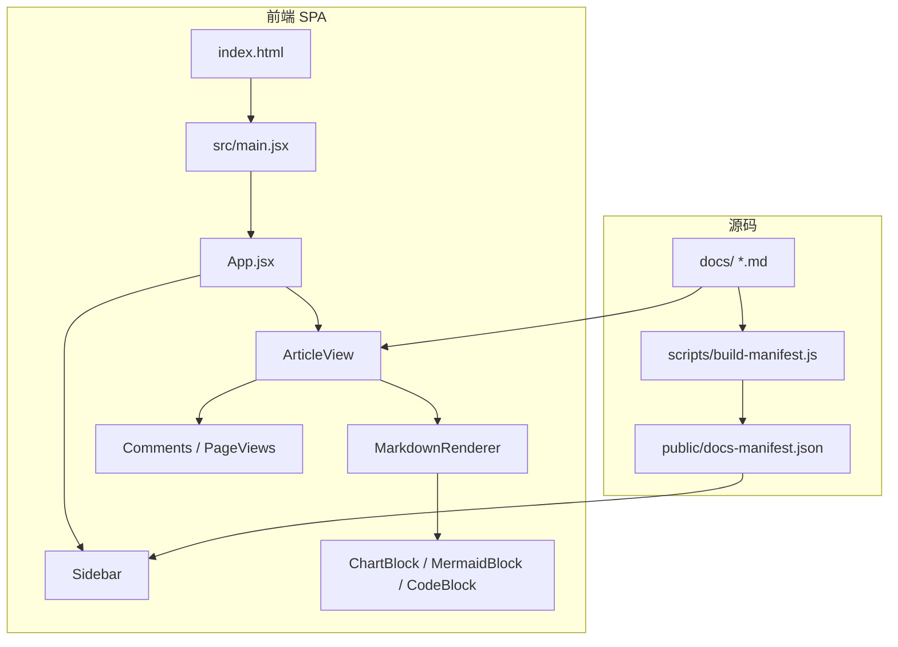
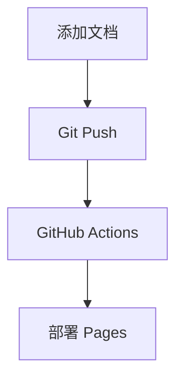

# 面试知识库 📖

面试文档知识库系统，支持自动扫描 Markdown 文档、渲染图表/公式/流程图，通过 GitHub Pages 一键部署。

---

## 一、系统架构



**技术栈：**

| 层 | 技术 | 用途 |
|---|------|------|
| 构建 | Vite 5 | 开发服务器 + 生产构建 |
| UI 框架 | React 18 | SPA 页面组件 |
| 路由 | react-router-dom 6 | HashRouter 页面切换 |
| Markdown | react-markdown 9 | 核心渲染引擎 |
| 数学公式 | KaTeX + remark-math + rehype-katex | LaTeX 公式渲染 |
| 图表 | Recharts | 饼图、柱状图、折线图等 |
| 流程图 | Mermaid | 流程图、时序图、状态图 |
| 文档扫描 | gray-matter (Node) | 构建时提取 YAML Front Matter |
| 部署 | GitHub Actions | 自动构建并部署到 Pages |

---

## 二、全部功能及用法

### 2.1 左侧文档树

构建时自动扫描 `docs/` 目录生成文档树，按目录层级展示。支持展开/折叠和搜索。

**效果：** 页面加载后左侧显示文件树

```
📂 java
  📂 java基础
    📚 collection
  📂 cli
  📂 web
📂 ai
  📂 skills
    🤖 机器学习基础
📄 README
📄 CONTRIBUTING
```

**用法：** 只要在 `docs/` 下放 `.md` 文件，构建时自动收录

---

### 2.2 YAML Front Matter 卡片

每篇 `.md` 文件头部用 `---` 包裹的元信息，渲染为蓝色主题卡片。

**效果：**

```
╔═══════════════════════════════════════════╗
║  📚 Java集合框架详解                       ║
║  分类: Java/Java基础  📅 2024-01-15       ║
║  [Java] [集合] [面试]                      ║
║  全面梳理 Java 集合框架核心知识点...        ║
╚═══════════════════════════════════════════╝
```

**写法：**

```yaml
---
title: Java集合框架详解
tags: [Java, 集合, 面试]
category: Java/Java基础
slug: java/java基础/collection
emoji: 📚
description: 完整的中文描述
created: 2024-01-15
updated: 2024-03-20
---
```

---

### 2.3 数学公式（KaTeX）

支持行内公式和块级公式。

**效果：**

行内：$E = mc^2$

块级：
$$
\int_{-\infty}^{\infty} e^{-x^2} \, dx = \sqrt{\pi}
$$

**写法：**

```markdown
行内公式：$E = mc^2$

块级公式：
$$
\int_{-\infty}^{\infty} e^{-x^2} \, dx = \sqrt{\pi}
$$
```

也支持 mathjax 代码块：

````markdown
```mathjax
f(x) = \sum_{i=1}^{n} i^2
```
````

---

### 2.4 图表（Recharts）

支持 `pie`、`bar`、`line`、`area`、`radar` 五种图表。

**效果：** 彩色可交互图表，鼠标悬停显示数据

**写法：**

````markdown
```chart
{
  "type": "pie",
  "title": "技术栈分布",
  "data": [
    { "name": "Java", "value": 40 },
    { "name": "Python", "value": 25 },
    { "name": "前端", "value": 20 }
  ]
}
```
````

各图表类型：

| 类型 | 说明 | 关键字段 |
|------|------|---------|
| `pie` | 饼图/环形图 | `angleField`, `colorField` |
| `bar` | 柱状图 | `xField`, `yField` |
| `line` | 折线图 | `xField`, `yField` |
| `area` | 面积图 | `xField`, `yField` |
| `radar` | 雷达图 | `xField`, `yField` |

---

### 2.5 流程图/时序图（Mermaid）

**效果：**



**写法：**

````markdown

````

时序图：

````markdown
```sequence
participant A as 客户端
participant B as 服务端
A->>B: 请求
B-->>A: 响应
```
````

支持所有 Mermaid 类型：

| 类型 | 代码块语言 | 说明 |
|------|-----------|------|
| 流程图 | `mermaid` | `graph TD / LR / BT` |
| 时序图 | `sequence` | `sequenceDiagram` |
| 饼图 | `mermaid` | 内置 `pie` 语法 |
| 类图 | `mermaid` | `classDiagram` |
| 甘特图 | `mermaid` | `gantt` |
| 状态图 | `mermaid` | `stateDiagram` |

---

### 2.6 代码块 + 复制按钮

所有代码块自动添加语言标签和复制按钮。

**效果：**

```
┌─ java ──────────────────── 📋 复制 ─┐
│                                     │
│  public class Hello {               │
│      public static void main(..)    │
│  }                                  │
│                                     │
└─────────────────────────────────────┘
```

点击复制按钮 → 自动复制到剪贴板，按钮变为 ✅ 已复制（1.8 秒后恢复）。

**写法：**

````markdown
```java
public class Hello {
    public static void main(String[] args) {}
}
```
````

不写语言也自动渲染为代码块：

````markdown
```
纯文本代码块
```
````

---

### 2.7 GitHub Alert 提示

5 种颜色不同的警报提示块。

**效果：**

> [!NOTE]
> 蓝色提示，用于补充信息

> [!TIP]
> 绿色提示，用于小技巧

> [!IMPORTANT]
> 紫色提示，用于重要信息

> [!WARNING]
> 橙色提示，用于警告

> [!CAUTION]
> 红色提示，用于谨慎操作

**写法：**

```markdown
> [!NOTE]
> 提示内容写在这里
```

| 类型 | 颜色 | 适用场景 |
|------|------|---------|
| NOTE | 蓝 | 补充信息 |
| TIP | 绿 | 实用技巧 |
| IMPORTANT | 紫 | 关键信息 |
| WARNING | 橙 | 注意提醒 |
| CAUTION | 红 | 风险警告 |

---

### 2.8 表格（Pipe Table）

标准 GFM 表格语法。

**效果：** 带边框的格式化表格

| 算法 | 类型 | 优点 |
|------|------|------|
| 线性回归 | 回归 | 简单 |
| 决策树 | 分类 | 可视化 |

**写法：**

```markdown
| 算法 | 类型 | 优点 |
|------|------|------|
| 线性回归 | 回归 | 简单 |
| 决策树 | 分类 | 可视化 |
```

---

### 2.9 阅读量统计

基于 GitHub Gist API 的跨设备阅读量计数器。

**效果：** 文章底部显示 👁️ 4（每次刷新 +4）

**启用配置：**

```js
// src/utils/gistCounter.js
const GIST_ID = '你的GistID'
const GIST_TOKEN = '你的Token（仅gist权限）'
```

---

### 2.10 评论系统（giscus）

基于 GitHub Discussions 的评论区，无需 OAuth App，无 token 泄露风险。

**效果：** 文章底部展示 GitHub 风格的评论区，每篇文章独立讨论

**启用步骤：**

1. 仓库 Settings → Features → 勾选 **Discussions**
2. 访问 [giscus App](https://github.com/apps/giscus) → Install → 选本仓库
3. 访问 [giscus.app](https://giscus.app/zh-CN) 填入 `xiuji008/xjdoc-interview` 获取 ID
4. 将 `repoId`、`categoryId` 填入：

```js
// src/components/Comments.jsx
const GISCUS_CONFIG = {
  repo: 'xiuji008/xjdoc-interview',
  repoId: 'R_kgDOSoPcRg',
  category: 'Announcements',
  categoryId: 'DIC_kwDOSoPcRs4C94wU',
}
```

- 使用 `data-mapping="specific"` + `data-term={slug}` 按文章独立分页
- 支持 GitHub Reactions（👍❤️🎉 等）

---

## 三、项目目录结构

```
xjdoc-interview/
├── docs/                           # 📁 文档源文件
│   ├── java/
│   │   ├── java基础/collection.md
│   │   ├── cli/
│   │   └── web/
│   ├── ai/
│   │   ├── skills/
│   │   ├── db/
│   │   └── shared/
│   ├── README.md
│   └── CONTRIBUTING.md
├── public/
│   ├── _config.yml                 # GitHub Pages 配置
│   └── docs-manifest.json          # 构建时自动生成的文档清单
├── scripts/
│   └── build-manifest.js           # 扫描 docs/ 生成 manifest
├── src/
│   ├── main.jsx                    # React 入口
│   ├── App.jsx                     # 路由 + 布局
│   ├── App.css                     # 全局样式
│   ├── components/
│   │   ├── Sidebar.jsx             # 左侧文档树
│   │   ├── ArticleView.jsx         # 文章详情页
│   │   ├── ArticleHeader.jsx       # Front Matter 卡片
│   │   ├── MarkdownRenderer.jsx    # 统一渲染管线
│   │   ├── MermaidBlock.jsx        # Mermaid 图渲染
│   │   ├── ChartBlock.jsx          # Recharts 图表渲染
│   │   ├── CodeBlock (内联)        # 代码块 + 复制按钮
│   │   ├── PageViews.jsx           # 阅读量统计
│   │   ├── Comments.jsx            # giscus 评论
│   │   └── ErrorBoundary.jsx       # 错误边界
│   ├── hooks/
│   │   ├── useDocManifest.js       # 加载文档清单
│   │   └── useDocContent.js        # 加载 .md + 解析 Front Matter
│   └── utils/
│       └── gistCounter.js          # GitHub Gist 计数器
├── .github/workflows/deploy.yml    # GitHub Actions 自动部署
├── worker-counter.js               # Cloudflare Worker 备用方案
├── vite.config.js
├── package.json
└── index.html
```

---

## 四、快速开始

```bash
# 1. 安装依赖
npm install

# 2. 生成文档清单 + 启动开发服务器
npm run dev

# 3. 打开浏览器访问
open http://localhost:5173

# 4. 构建生产版本
npm run build
```

---

## 五、部署

推送 `main` 分支到 GitHub 后，`.github/workflows/deploy.yml` 自动执行：

1. `npm ci` — 安装依赖
2. `npm run build` — 生成 manifest + 构建 SPA
3. 部署到 GitHub Pages

> 需要在仓库 Settings > Pages 中设置 Source 为 **GitHub Actions**。

---

## 六、添加新文档

```yaml
---
title: 文档标题
tags: [标签1, 标签2]
category: 分类/子分类
slug: 路径/文件名（唯一标识）
emoji: 📝
description: 简短描述
---
```

将 `.md` 文件放入 `docs/` 下对应目录 → 提交推送 → 自动部署上线。
