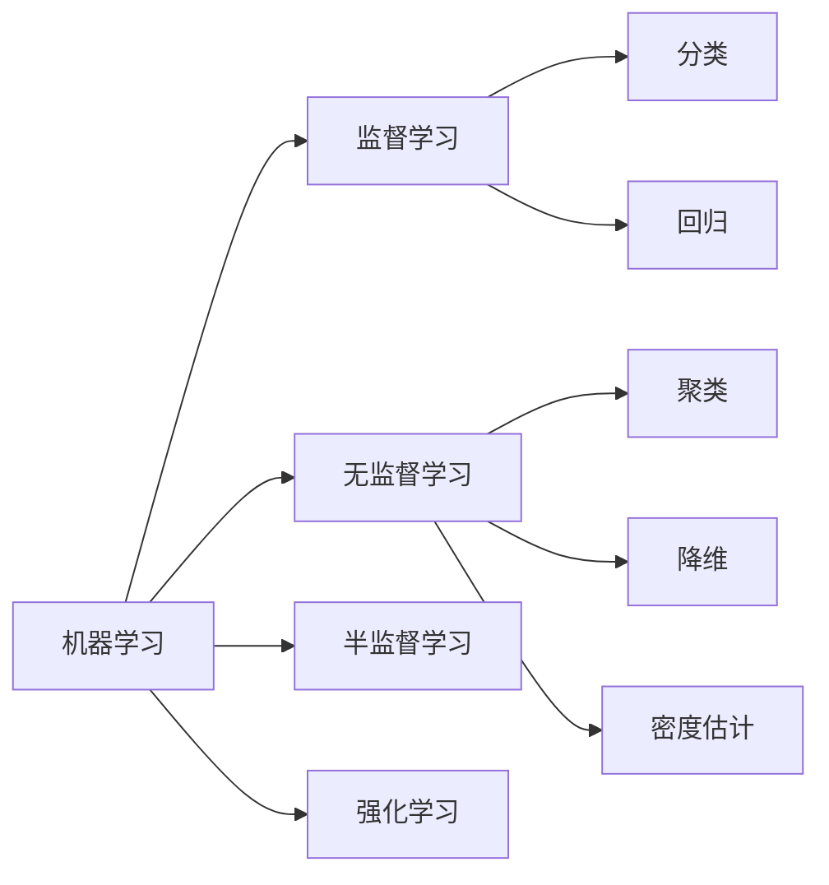
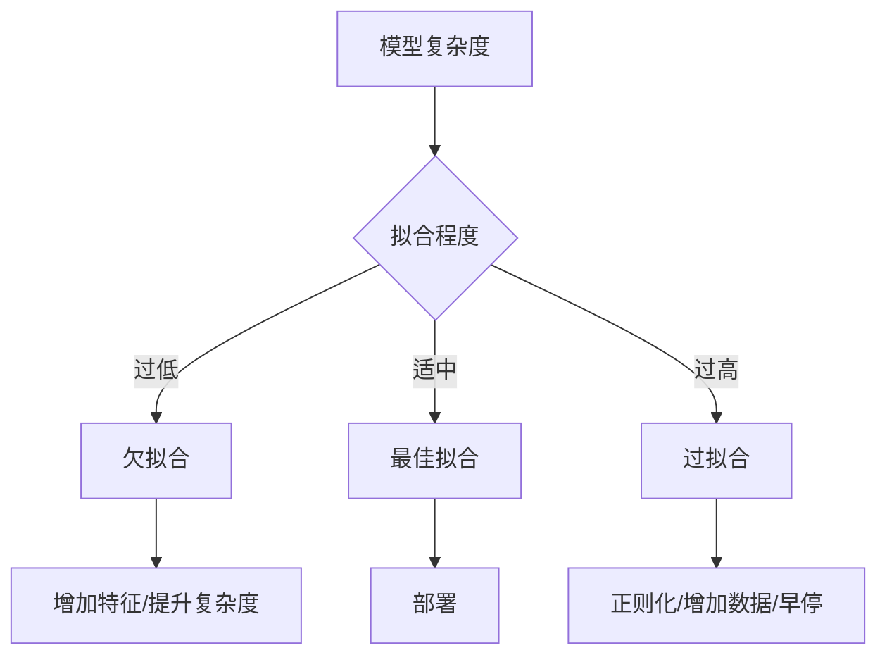

# 机器学习基础概念

## 一、学习范式分类



## 二、常见算法对比

| 算法 | 类型 | 适用场景 | 优点 | 缺点 |
|------|------|---------|------|------|
| 线性回归 | 回归 | 预测连续值 | 简单、可解释性强 | 只能拟合线性关系 |
| 逻辑回归 | 分类 | 二分类 | 输出概率、计算快 | 决策边界线性 |
| 决策树 | 分类/回归 | 可解释场景 | 可视化、无需归一化 | 容易过拟合 |
| 随机森林 | 分类/回归 | 通用任务 | 抗过拟合、特征重要性 | 模型大、慢 |
| SVM | 分类/回归 | 小样本 | 泛化能力强 | 参数敏感 |
| KNN | 分类/回归 | 小数据集 | 无需训练 | 计算量大 |
| K-Means | 聚类 | 无标签数据 | 简单高效 | 需指定 K 值 |

## 三、评估指标

### 分类指标

$$
\text{Accuracy} = \frac{TP + TN}{TP + TN + FP + FN}
$$

$$
\text{Precision} = \frac{TP}{TP + FP}
$$

$$
\text{Recall} = \frac{TP}{TP + FN}
$$

$$
F_1 = 2 \cdot \frac{\text{Precision} \cdot \text{Recall}}{\text{Precision} + \text{Recall}}
$$

### 回归指标

$$
MSE = \frac{1}{n} \sum_{i=1}^{n} (y_i - \hat{y}_i)^2
$$

$$
R^2 = 1 - \frac{\sum (y_i - \hat{y}_i)^2}{\sum (y_i - \bar{y})^2}
$$

## 四、过拟合与欠拟合



## 五、面试高频题统计

```chart
{
  "type": "bar",
  "title": "机器学习面试高频题统计",
  "data": [
    { "name": "过拟合处理", "count": 35 },
    { "name": "梯度下降", "count": 28 },
    { "name": "损失函数", "count": 25 },
    { "name": "正则化", "count": 22 },
    { "name": "评估指标", "count": 20 },
    { "name": "特征工程", "count": 18 },
    { "name": "集成学习", "count": 15 },
    { "name": "SVM原理", "count": 12 }
  ],
  "xField": "name",
  "yField": "count"
}
```

## 六、特征缩放方法对比

```chart
{
  "type": "radar",
  "title": "特征缩放方法优缺点对比",
  "data": [
    { "name": "标准化", "易用性": 5, "鲁棒性": 3, "保持分布": 5, "计算效率": 4, "适用广度": 5 },
    { "name": "归一化", "易用性": 5, "鲁棒性": 2, "保持分布": 3, "计算效率": 5, "适用广度": 3 },
    { "name": "RobustScaler", "易用性": 3, "鲁棒性": 5, "保持分布": 3, "计算效率": 3, "适用广度": 4 }
  ],
  "xField": "name",
  "yField": "易用性"
}
```
