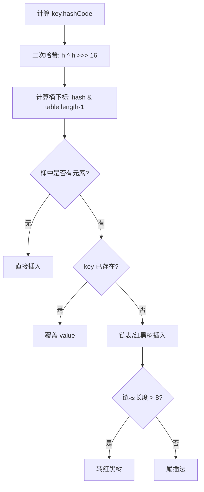

# Java集合框架详解

## 一、集合框架概述

Java 集合框架主要分为两大接口：**Collection** 和 **Map**。

```
Collection
├── List       (有序、可重复)
│   ├── ArrayList
│   ├── LinkedList
│   └── Vector
├── Set        (无序、不可重复)
│   ├── HashSet
│   ├── LinkedHashSet
│   └── TreeSet
└── Queue      (队列)
    ├── PriorityQueue
    └── Deque

Map            (键值对)
├── HashMap
├── LinkedHashMap
├── TreeMap
└── Hashtable
```

## 二、ArrayList vs LinkedList

| 特性 | ArrayList | LinkedList |
|------|-----------|------------|
| 底层结构 | 动态数组 | 双向链表 |
| 随机访问 | $O(1)$ | $O(n)$ |
| 插入/删除 | $O(n)$ | $O(1)$ |
| 内存占用 | 较少 | 较大（需存储指针） |
| 线程安全 | 否 | 否 |

### 时间复杂度对比

```chart
{
  "type": "bar",
  "title": "ArrayList vs LinkedList 时间复杂度对比",
  "data": [
    { "name": "随机访问", "ArrayList": 1, "LinkedList": 100 },
    { "name": "末尾插入", "ArrayList": 1, "LinkedList": 1 },
    { "name": "中间插入", "ArrayList": 100, "LinkedList": 1 },
    { "name": "头部插入", "ArrayList": 100, "LinkedList": 1 }
  ],
  "xField": "name",
  "yField": "ArrayList"
}
```

## 三、HashMap 底层原理

### 3.1 数据结构

HashMap 底层是 **数组 + 链表 + 红黑树**（JDK 1.8+）。

$$
\text{数组长度} = 16 \quad(\text{默认}, 2^n)
$$

$$
\text{扩容阈值} = \text{容量} \times \text{负载因子} \;(0.75)
$$

### 3.2 put 流程



### 3.3 扩容机制

当元素数量超过 `threshold = capacity × loadFactor` 时，触发扩容：

$$
\text{新容量} = \text{旧容量} \times 2
$$

扩容后，元素的新位置要么在原位置，要么在 `原位置 + 旧容量`。

## 四、ConcurrentHashMap 原理

### 分段锁机制

```sequence
participant Thread1 as 线程1
participant Thread2 as 线程2
participant CHM as ConcurrentHashMap
participant Seg1 as Segment 0
participant Seg2 as Segment 1

Thread1->>CHM: put("key1", val1)
CHM->>Seg1: 锁定 Segment 0
Seg1->>Seg1: 写入数据
Seg1-->>CHM: 释放锁
Thread2->>CHM: put("key2", val2)
CHM->>Seg2: 锁定 Segment 1 (不同段，不阻塞)
Seg2->>Seg2: 写入数据
Seg2-->>CHM: 释放锁
```

> JDK 1.8 以后采用 CAS + synchronized 实现更细粒度的并发控制。

## 五、集合使用建议

```chart
{
  "type": "pie",
  "title": "面试中集合类考察频率分布",
  "data": [
    { "name": "HashMap", "value": 40 },
    { "name": "ArrayList", "value": 20 },
    { "name": "ConcurrentHashMap", "value": 18 },
    { "name": "HashSet", "value": 10 },
    { "name": "TreeMap", "value": 7 },
    { "name": "其他", "value": 5 }
  ],
  "angleField": "value",
  "colorField": "name"
}
```

### 选型建议

1. **需要快速随机访问** → `ArrayList`
2. **频繁插入/删除** → `LinkedList`
3. **需要线程安全** → `CopyOnWriteArrayList` / `ConcurrentHashMap`
4. **需要有序键值对** → `TreeMap`（红黑树，$O(\log n)$）
5. **保持插入顺序** → `LinkedHashMap`

## 六、常见面试题

$$ 时间复杂度公式: O(1) < O(\log n) < O(n) < O(n^2) $$

1. **HashMap 的容量为什么是 2 的幂次？** → 因为 `hash & (len - 1)` 等价于取模，且计算速度更快。
2. **HashMap 线程安全吗？** → 不安全，多线程环境下使用 `ConcurrentHashMap`。
3. **HashSet 如何保证元素不重复？** → 底层基于 HashMap，元素作为 key 存储。
